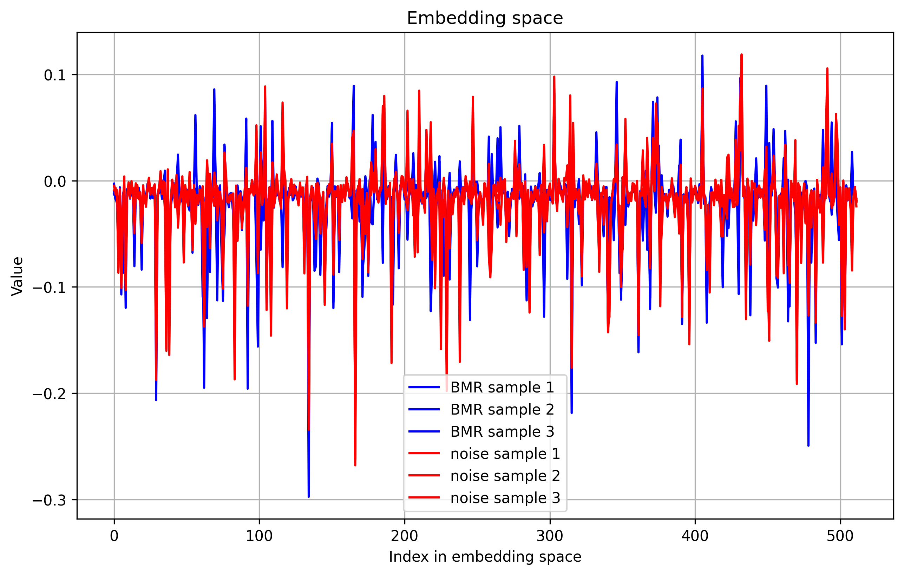

# MoleRatsClassifier

## General description

Blind mole rats (BMR) are mammals that live in tunnels under-ground 
and communicate by ramming their heads against the tunnel walls.

This project has 2 goals:  
1. Distinguishing between sounds produced by different individual BMR.
2. Pointing out audio properties that take part in the classification.

The data used in the project was provided by prof. Yossi Yovel from Tel-Aviv University. 

## The dataset
The dataset contains recordings of 5 different BMR. 
The audio is given in labeled multi-channel .WAV files.

## Analyzing the data
The plots below show a pulse created by a BMR, 
presented in time domain and in frequency domain (FFT and STFT). 

The plots below show typical channel-noise, presented in time domain and in frequency domain (FFT and STFT). 

Out of the 3 representations of the data, the clearest representation of the pulse is the time domain representation.
Therefore, classification in time domain was chosen over classification in frequency domain.

## The classifier
The classifier consists of 2 parts:

1. WavLM encoder, suitable for speech recognition and for speaker verification tasks. Description in the paper: 
https://arxiv.org/abs/2110.13900 and in HuggingFace: https://huggingface.co/microsoft/wavlm-base-plus-sv.
2. Classifier over the embedding space of the encoder, a few methods were tested.

Over all, the classification is between 5 classes of BMR and one class of noise (6 classes in total).

## Noise handling
Initially, the recordings were sampled uniformly, to get a notion for how significant is the noise. 
Classification between samples from different recordings reached accuracy of about 90%. 

The conclusion is that the background noise is significant, and in order to get a valid classifier, 
it is necessary to distinguish also between noise and recorded BMR, not only between pulses created by different BMR.

## Results

| Classification method  Over embedding space | Accuracy  Range: [0-1] | Total training time  HW: NVIDIA GeForce MX450 [sec] |
|-------------------------------------------------|----------------------------|---------------------------------------------------------|
| K-means                                         | 0.0612                     | 0.3749                                                  |
| KNN, k=3, cosine distance                       | 0.7146                     | 10.157                                                  |
| SVM, rbf kernel                                 | 0.7353                     | 1.6959                                                  |
| FC-NN (MLP), 1 hedden layer                     | 0.7777                     | 5.3749                                                  |
| FC-NN (MLP), 2 hidden layers, drop-out          | 0.7797                     | 21.5029                                                 |
| FC-NN (MLP), 3 hidden layers, drop-out, batch-norm   | 0.7746                     | 21.0224                                                 |
| LSTM, using last hidden state                   | 0.7797                     | 22.9475                                                 |

Over all, maximal accuracy achieved is around 77%.

## The embedding space

The plot below shows samples containing pulses created by BMR, and samples containing only channel noise.  

Some trends may be pointed out, however, it is not clear what makes the classification possible.

## Conclusions

1. Empirically, classification between different BMR individuals and between noise is demonstrated.

2. Almost all classification methods over the embedding space resulted in similar accuracy rates, 
which implies that the encoder is the significant part of the classification, not the classifiers over the embedding space. 

3. Conclusion from #2 - the WavLM encoder used, that was trained for speech recognition and speaker verification tasks on human language, 
preforms well in the equivalent tasks for BMR 'language'.

4. Properties of the audio that are significant for the classification process are not clear, 
as could be expected. Deep learning algorithms are in that sense
'black-boxes' - it's almost impossible to point out why they decide one way or another. 

5. The channel-noise is probably not a significant audio property for the classification process.
If it was, accuracy rates in confusion matrix 2 (between noise and BMR pulses) would probably be lower. 
   
## Appendix: confusion matrices

Confusion matrix 1: between the 6 classes (5 BMR and 1 noise).

Confusion matrix 2: between noise and BMR pulses.

